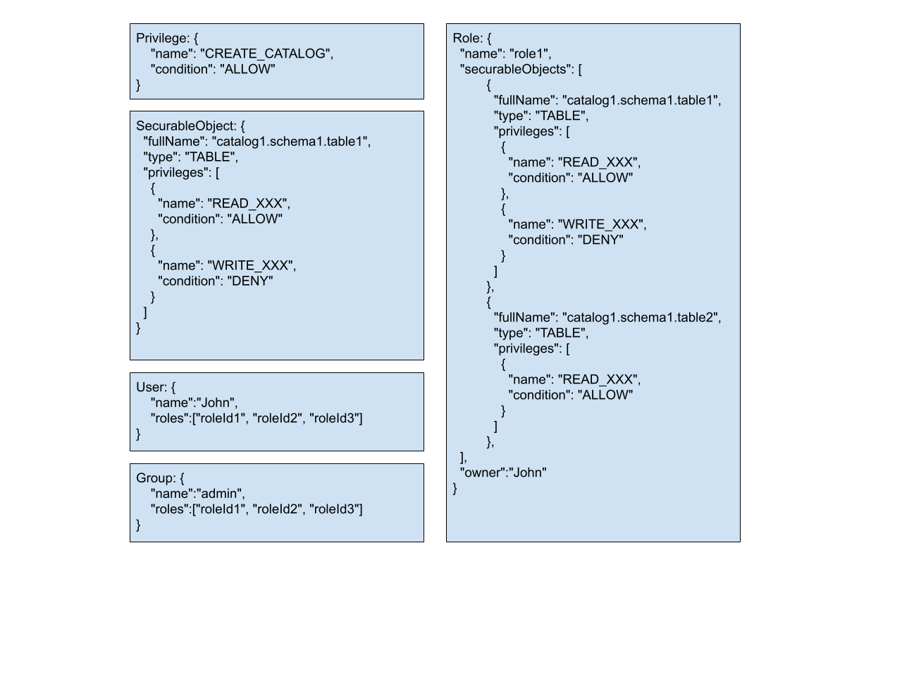
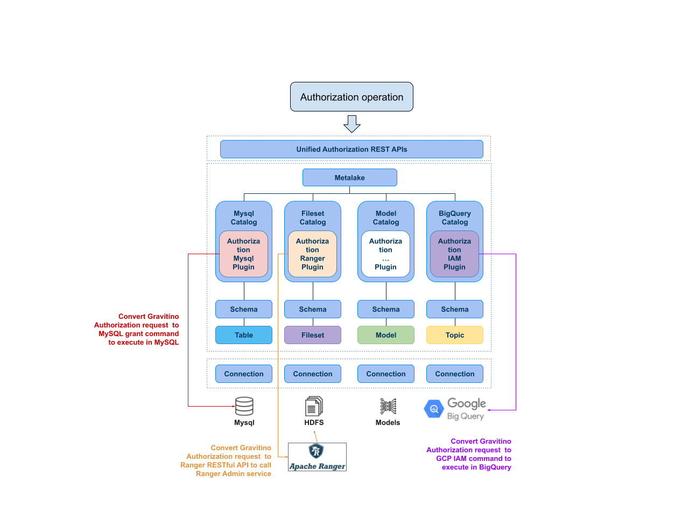

This blog post will briefly introduce the new features and significant improvements. Keep reading to
learn what the community has worked on and understand Gravitino’s use cases.

## Introducing the unified RBAC model for Gravitino

Access control is a crucial feature for the enterprise use of a data catalog, providing users with
unified and centralized authorization and authentication capabilities. This release introduces a
role-based access control (RBAC) model in Gravitino to authorize different securable objects in a
unified manner.

We use `Privilege`, `SecurableObject`, `Role`, `User`, and `Group` to define the permissions.

**Privilege**

Privilege defines the types of operations on different metadata objects, and is used to allow or
deny a specific type of operation on a metadata object.

**SecurableObject**

SecurableObject binds multiple operation-specific types of privileges to a single metadata object.

**Role**

A Role is a collection of SecurableObjects, and a role represents multiple operation type
permissions on multiple metadata objects.

**User**
Users are granted one or multiple roles, and users have different operating privileges depending 
on their roles.

**Group**

To make it easier to grant a single permission to multiple users, we can add users to a group,
and then grant one or more roles to that user group. This process allows all users belonging to
that user group to have the permissions in those roles.

More importantly, the privileges authorized by the user in Gravitino will be pushed down to
the underlying permission system. Currently, we support push permissions to Apache Ranger,
others like IAM are under development.

For more information about how our RBAC works, please check out our [design document](https://docs.google.com/document/d/11MF1PTN5UTKJf3WLuHqhCikQzJoLxaXM_AEDZpXhO2I/edit?usp=sharing).
To enable and use access control in Gravitino, please refer to the [user document](https://gravitino.apache.org/docs/0.6.0-incubating/security/access-control).

Our implementation of unified access control capability is still in the alpha stage, and we’re
striving to add more features and make it stable as soon as possible, so please stay tuned.

## Separation of the Iceberg REST catalog service

Apache Iceberg is a first-class citizen, and Gravitino has provided an embedded Iceberg REST catalog
service since version 0.3. We have seen the increased demands and adoption of Iceberg REST catalog
service as a standalone server. So, in version 0.6.0, we refactored the whole architecture and
modularized the Iceberg REST catalog service as a standalone service, allowing it to be deployed
with or without the Gravitino server. Besides the refactoring, we also bumped the supported version
to Iceberg 1.5.2, added support for S3 cloud storage, and now support the `registerTable` interface.

Iceberg REST catalog support is crucial to Gravitino, and modularization is just the first step.
In future releases, we will add more features like cloud storage support and integrating Gravitino’s
RBAC model, credential vending, etc.

To use the Gravitino Iceberg REST catalog service, please check our [user document](https://gravitino.apache.org/docs/0.6.0-incubating/iceberg-rest-service).
The umbrella issue is [#4058](https://github.com/apache/gravitino/issues/4058).

## Tagging support

Tagging on metadata objects is useful for data discovery, classification, and data governance.
It can also be leveraged by query engines to provide tag-based access control. In Gravitino 0.6.0,
we introduce tag support users can add tags on metadata objects like `CATALOG`, `SCHEMA`, `TABLE`,
`FILESET`, and `TOPIC`. To know how our tag system is designed, please check out the 
[design document](https://docs.google.com/document/d/1zkQWla8OMIPY61HqKUivpf43cTteNvcd2w_oA32yAfg/edit#heading=h.26ac49mb3u1q)
and issue [#3344](https://github.com/apache/gravitino/issues/3344). To use 
tags in both REST API and Java SDK, please see [how to manage tags](https://gravitino.apache.org/docs/0.6.0-incubating/manage-tags-in-gravitino).

## Apache Flink Gravitino connector

As an open data catalog, we want to be able to support all query engines. Therefore, alongside Trino
and Apache Spark, we have added Apache Flink as our newest supported query engine.

In 0.6.0, we added a new Flink Gravitino connector [#1354](https://github.com/apache/gravitino/issues/1354)
and supported querying Hive tables using Flink with Gravitino. Hive support is just our first step,
we will continue to add more table support.

To know how to use the Flink Gravitino connector, please refer to our [documentation](https://gravitino.apache.org/docs/0.6.0-incubating/flink-connector/flink-connector).

## Apache Paimon table management in Gravitino

Apache Paimon has become quite popular this year, and many companies use Paimon to build their
streaming warehouse or lakehouse. To manage all the lakehouse tables in a unified manner, Gravitino
has added Paimon table management in 0.6.0 [#1129](https://github.com/apache/gravitino/issues/1129).
Users can use our unified API to manage Paimon tables as well as other tables.
To know more about how to manage Paimon tables, please refer to [Lakehouse Paimon Catalog document](https://gravitino.apache.org/docs/0.6.0-incubating/lakehouse-paimon-catalog).

## Add Python GVFS support for fileset

In Gravitino 0.5, we added a Java Hadoop Compatible Filesystem (HCFS) support (GVFS) for fileset
read/write in Gravitino. The provided Java GVFS can be used by query engines like Apache Spark to
read/write data from files or folders. Although this works well in big data, AI development is
largely dominated by Python, which can create an obstacle and hinder users from using Fileset with AI frameworks.

In 0.6.0, we followed the Python fsspec to provide a Python GVFS package that can be used by popular
Python frameworks like Apache Arrow, Pandas, Ray, LlamaIndex, and more. You can check 
out [Python GVFS document](https://gravitino.apache.org/docs/0.6.0-incubating/how-to-use-gvfs#2-managing-files-of-fileset-with-python-gvfs) for more information.

## Notable enhancements

### Gravitino core

* Support catalog reload after a property is altered [#2267](https://github.com/apache/gravitino/issues/2267).
* Deprecate KV store and add H2 support as embedded storage backend [#3968](https://github.com/apache/gravitino/issues/3968).

### Catalog relate

* Add API test catalog connection [#4107](https://github.com/apache/gravitino/issues/4107). 
* Improve the type system to support unknown types [#3427](https://github.com/apache/gravitino/issues/3427). 
* Add Kerberos support for fileset Hadoop catalog [#3462](https://github.com/apache/gravitino/issues/3462). 
* Add S3 support for Iceberg [#4264](https://github.com/apache/gravitino/issues/4264). 
* Support cloud and region property when creating catalog [#3966](https://github.com/apache/gravitino/issues/3966). 
* Support multiple Kerberos authentication for Hive catalog [#3906](https://github.com/apache/gravitino/issues/3906). 
* Unify the behavior of purge for all the catalogs [#3685](https://github.com/apache/gravitino/issues/3685).

### API and client

* Refactor Java and Python API for better user experience [#3626](https://github.com/apache/gravitino/issues/3626).
* Add missing error handlers in Python client [#4225](https://github.com/apache/gravitino/issues/4225).

All the resolved issues targeting the 0.6.0 release can be seen at https://github.com/apache/gravitino/issues?page=12&q=is%3Aissue+is%3Aclosed+label%3A0.6.0.

## Overall

Apache Gravitino 0.6.0 is the first ASF release, we would like to show appreciation to the Gravitino
community for their continued support and valuable contributions. Thanks to the feedback of our users,
we are able to continue to innovate and build, so thanks to all those reading this!

To explore Gravitino 0.6.0 release, please check [the documentation](https://gravitino.apache.org/docs/0.6.0-incubating).
Your feedback is invaluable to the community and the project.

## Credits
This release acknowledges the hard work and dedication of all contributors who have helped make this
release possible.

[@1996fanrui](https://github.com/1996fanrui)
[@BSSsunny](https://github.com/BSSsunny)
[@FANNG1](https://github.com/FANNG1)
[@IamSaker](https://github.com/IamSaker)
[@JinsYin](https://github.com/JinsYin)
[@JosefinaOller](https://github.com/JosefinaOller)
[@LanceHsun](https://github.com/LanceHsun)
[@LauraXia123](https://github.com/LauraXia123)
[@Leonidas963](https://github.com/Leonidas963)
[@LindaSummer](https://github.com/LindaSummer)
[@MukarramHaq](https://github.com/MukarramHaq)
[@Naresh-kumar-Thodupunoori](https://github.com/Naresh-kumar-Thodupunoori)
[@Nishtha-Jain-1119](https://github.com/Nishtha-Jain-1119)
[@SteNicholas](https://github.com/SteNicholas)
[@TEOTEO520](https://github.com/TEOTEO520)
[@Vishesh-Paliwal](https://github.com/Vishesh-Paliwal)
[@ashwin1596](https://github.com/ashwin1596)
[@bknbkn](https://github.com/bknbkn)
[@caican00](https://github.com/caican00)
[@ch3yne](https://github.com/ch3yne)
[@charliecheng630](https://github.com/charliecheng630)
[@coolderli](https://github.com/coolderli)
[@danhuawang](https://github.com/danhuawang)
[@diqiu50](https://github.com/diqiu50)
[@featherchen](https://github.com/featherchen)
[@hanwxx](https://github.com/hanwxx)
[@ian910297](https://github.com/ian910297)
[@jenish-thapa](https://github.com/jenish-thapa)
[@jerqi](https://github.com/jerqi)
[@jerryshao](https://github.com/jerryshao)
[@jingjia88](https://github.com/jingjia88)
[@jtao1](https://github.com/jtao1)
[@justinmclean](https://github.com/justinmclean)
[@kalencaya](https://github.com/kalencaya)
[@khmgobe](https://github.com/khmgobe)
[@kiratkumar47](https://github.com/kiratkumar47)
[@kohantikanath](https://github.com/kohantikanath)
[@kristopherkane](https://github.com/kristopherkane)
[@lsyulong](https://github.com/lsyulong)
[@lw-yang](https://github.com/lw-yang)
[@mchades](https://github.com/mchades)
[@mygrsun](https://github.com/mygrsun)
[@noidname01](https://github.com/noidname01)
[@pan3793](https://github.com/pan3793)
[@pravo23](https://github.com/pravo23)
[@qqqttt123](https://github.com/qqqttt123)
[@rich7420](https://github.com/rich7420)
[@rohit-satya](https://github.com/rohit-satya)
[@shaofengshi](https://github.com/shaofengshi)
[@theoryxu](https://github.com/theoryxu)
[@totalo](https://github.com/totalo)
[@unknowntpo](https://github.com/unknowntpo)
[@xiaozcy](https://github.com/xiaozcy)
[@xloya](https://github.com/xloya)
[@xunliu](https://github.com/xunliu)
[@yijhenlin](https://github.com/yijhenlin)
[@yuqi1129](https://github.com/yuqi1129)
[@zhoukangcn](https://github.com/zhoukangcn)
[@zivali](https://github.com/zivali)

Apache Gravitino is an effort undergoing incubation at The Apache Software Foundation (ASF),
sponsored by ASF Incubator. Incubation is required of all newly accepted projects until a further
review indicates that the infrastructure, communications, and decision making process have
stabilized in a manner consistent with other successful ASF projects. While incubation status is not
necessarily a reflection of the completeness or stability of the code, it does indicate that the
project has yet to be fully endorsed by the ASF.

Apache, Apache Iceberg, Apache Hive, Apache Fink, Apache Paimon and Apache Gravitino are either
registered trademarks or trademarks of the Apache Software Foundation in the United States 
and/or other countries.
