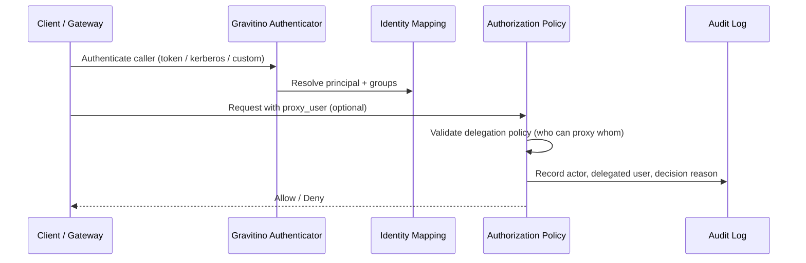

###

### **Introduction**

I've spent a lot of time thinking about authentication less as a “login feature” and more as **how trust enters the system**. In a traditional single-system architecture, it is easy to treat auth as a box you tick. In a Catalog of Catalogs architecture, it felt different to me: authentication becomes a **trust integration** problem—many doors in, one coherent idea of who is asking for what.

Gravitino is aimed at heterogeneous enterprise environments: multi-cloud, hybrid-cloud, mixed identity providers, and multiple runtime channels. When we mapped that landscape, the hardest question for me was not really “which protocol should we use?” It was **how we keep identity semantics consistent when authentication paths are genuinely diverse**.

In this post I'm staying deliberately narrow: **User → Gravitino authentication** only. I'm not unpacking downstream catalog authentication here—not because it is unimportant, but because I wanted one clear thread without collapsing two different trust problems into one article.

That distinction matters to me personally. I've watched architecture discussions slide into tooling debates while the real lever—**identity normalization, trust boundaries, failure semantics, governance**—stayed implicit. My takeaway from working through this was that authentication quality tracks those design choices more than it tracks picking a fashionable protocol.

###

### **Scope of This Post**

Here's what I'm covering:

- User authentication entry into Gravitino.
- Identity extraction and normalization.
- Multi-authenticator coexistence and trust convergence.
- Group and role design boundaries.
- Proxy user design considerations.
- Extensibility through authenticator plugins.

And what I'm explicitly skipping for now:

- Gravitino-to-underlying-catalog authentication patterns.
- Credential vending internals.
- Downstream impersonation semantics.

### **High-Level Architecture View**

```mermaid
flowchart LR
  U[End User / Workload] --> C[Access Channel<br/>UI / API / Engine]
  C --> A[Authenticator Layer<br/>simple | oauth | kerberos | custom]
  A --> N[Identity Normalization<br/>principalFields + mapping]
  N --> P[Policy Context<br/>user group roles proxy metadata]
  P --> Z[Authorization and Audit]
```

When I picture northbound authentication for Gravitino, this is the mental model I keep returning to: **we can allow diverse entry modes, but they have to converge into one normalized policy context** before authorization and auditing—otherwise “mixed reality” becomes “mixed policy,” and that is where incidents hide.

###

### **Challenges in User -> Gravitino Authentication**

#### **1) Identity heterogeneity across enterprise environments**

What shows up in real deployments is rarely one clean identity story. One organization can run multiple identity systems and naming conventions at once; claims differ by IdP, principals differ by product, group semantics differ by platform.

I worried early that if Gravitino treated identity as raw input instead of **normalized trust context**, we'd see policy behave inconsistently without an obvious single bug to chase.

A concrete example that stuck with me is principal ambiguity: one IdP may prefer `preferred_username`, another only guarantees `sub`, a third may surface email-style identity. Without deterministic extraction rules, I kept imagining the same human showing up as multiple principals in access control and audit trails—and **that** felt like the kind of subtle failure that erodes trust in the whole control plane.

#### **2) Mixed access channels require mixed authentication paths**

Different channels pulled us toward different practical answers:

- UI and interactive API users often fit OAuth/OIDC flows best.
- Some data platform paths are still heavily Kerberos-oriented.
- Development and local testing often need low-friction `simple` mode.

So I stopped treating “one global authenticator strategy” as realistic for the enterprises we care about. For me, mixed-mode support became a **design requirement**, not temporary compatibility glue.

The framing that helped was separating **protocol diversity** from **policy diversity**:

- Protocol diversity feels expected—and even healthy—in enterprise environments.
- Policy diversity for equivalent identities felt dangerous; I wanted that minimized.

In other words: channels can differ, but policy semantics should converge.

###

#### **3) Group identity can drift over time**

Many authorization failures I've seen were not “login failed,” but **stale or mismatched user–group relationships**. If group truth is fragmented, role enforcement gets noisy and unreliable.

In large organizations, that pattern shows up during org changes, contractor lifecycle events, cross-team projects. If group semantics aren't anchored in one authority, access updates lag and policy intent quietly diverges from runtime behavior—I've learned to treat that drift as a first-class risk, not an operational footnote.

#### **4) Extensibility is mandatory, not optional**

Enterprises kept surfacing custom identity integration needs—LDAP is the example everyone names, but the broader point was **we can't ship a closed authenticator model** and expect to serve long-lived heterogeneous ecosystems.

What I took away wasn't “support more protocols” as a slogan. It was: **support controlled extension without fragmenting trust semantics**—because once semantics splinter, every integration pays the tax.

#### **5) Proxy user creates power and risk at the same time**

Proxy user patterns kept appearing in shared compute and gateway mediation scenarios. I could see why teams want them—but also how easily proxy semantics become an **implicit privilege escalation path** if we aren't careful.

The tension I sit with is: proxy user enables practical operations, but expands the security surface. I wanted a design that preserves delegation utility **without** letting identity get fuzzy at the moment we need accountability most.

###

### **What We Landed On (and Why)**

#### **1) Multi-authenticator, with explicit coexistence**

Gravitino supports multiple authentication mechanisms:

- `simple`
- `oauth`
- `kerberos`
- custom authenticators

We kept `simple` intentionally lightweight, in the spirit of Hadoop simple mode: the client supplies a username context (for example from environment or user context), and the server treats that identity as the request principal without strong cryptographic proof from an external IdP.

That trade made sense to me for:

- local development,
- functional testing,
- PoC environments where identity infrastructure isn't wired yet.

But I don't mentally file `simple` next to “production-grade identity control.” It means:

- no external identity proof chain,
- higher spoofing risk if network and runtime boundaries are weak,
- limited fit for strict audit and compliance expectations.

So my practical recommendation is blunt: use `simple` where developer speed matters, and move to stronger modes (`oauth`, `kerberos`, or controlled custom auth) when governance expectations kick in.

Multiple authenticators can be configured together so one deployment can match different access channels. That wasn't only “migration convenience” for me—it reflected how mixed enterprises actually run.

For example, I've pictured a single enterprise routing UI and interactive API traffic through OAuth/OIDC while keeping Kerberos for data platform paths that already depend on established Kerberos trust. That coexistence is the point.

#### **2) OAuth as a first-class path**

We leaned into OAuth because it matches how modern enterprise identity and cloud-native operations tend to work. In Gravitino, OAuth support includes:

- Static signing key validation for controlled environments.
- JWKS-based validation for dynamic key management and OIDC ecosystems.
- OIDC-oriented Web UI integration.
- API bearer-token usage patterns.

I'm not arguing OAuth because it is trendy. I'm arguing it because it gives operations a strong center for federated enterprise identity.

From an architecture angle, OAuth gave me three properties I cared about:

- standard token semantics across many providers,
- clear validation boundaries,
- practical alignment between user-facing login and API authentication models.

It is also where I watched teams underestimate complexity. OAuth “working” isn't only token verification—it is making sure verified identity becomes a **stable authorization subject** with predictable semantics over time. That second step is where design actually lives.

#### **3) Identity extraction and normalization**

Identity claims aren't uniform across IdPs. We added claim fallback extraction (for example with `principalFields`) so principal resolution stays stable when token claim priorities differ by provider.

I don't treat that as polish. I treat it as **trust consistency**: when extraction is explicit, authorization becomes more predictable and incident analysis becomes more trustworthy.

#### **4) User/group mapping as a formal abstraction**

Different identity domains use different user and group naming schemes. We leaned on mapping abstractions so identity can normalize **before** policy evaluation.

That choice was partly about avoiding connector-by-connector ad hoc translation—and partly about safety: if naming conventions or identity providers change, I'd rather adapt translation at the abstraction layer than chase scattered integration logic.

#### **5) IdP as single source of truth for user/group**

A decision I keep defending: **Gravitino should be identity-integrated, not identity-authoritative.**

- IdP remains the source of truth for users and groups.
- Gravitino focuses on authentication integration, normalization, and governance.
- Gravitino acts as an identity-aware authorization platform, not a full-featured IAM directory.

I pushed this because it minimizes identity drift and avoids standing up a duplicate IAM system inside the platform.

It also clarifies ownership: IdP owns identity truth; Gravitino owns **interpretation for policy execution**—which sounds subtle until you've watched two teams argue about “whose user record is real.”

That boundary matters most where IAM is already mature (`LDAP`, `AD`, `Okta`, `Azure AD`, `Keycloak`, and others). Rebuilding user master-data management inside Gravitino looked to me like duplicate control planes, synchronization complexity, and inconsistency risk we didn't need.

By not positioning Gravitino as a primary IAM directory, we could stay focused on what I think matters for a Catalog of Catalogs architecture:

- unified authorization semantics across heterogeneous catalogs,
- consistent identity-to-policy translation,
- governance-grade auditability.

And “not identity-authoritative” doesn't mean “no user-related knobs.” We still allow limited operational capabilities where they are practical and safe:

- bootstrap user handling for local development and PoC environments,
- user/group cache and mapping strategies for runtime consistency,
- break-glass admin mechanisms for emergency operations,
- audit-oriented identity snapshots for traceability (without becoming authoritative identity records).

#### **6) Role and group are complementary, not redundant**

A question that kept coming back: if role exists, do we still need group?

My answer is yes.

- Roles answer: **what can be done**.
- Groups answer: **who moves together** in organizational lifecycle.

Dropping groups can look simpler on day one, but I've seen it turn into long-term governance debt in enterprise operations.

A pattern I like is keeping role definitions stable and letting group membership absorb organizational churn—policy models stay durable, and you reduce per-user permission thrash.

#### **7) Plugin-based extensibility**

We exposed an extensible authenticator plugin mechanism so enterprises can integrate environment-specific identity requirements without breaking the platform's trust architecture.

LDAP is the common example here, and future native support fits naturally into that model.

I only consider the plugin model “good” if it stays governable: extension points should preserve common audit fields, consistent principal semantics, and clear security expectations—otherwise extensibility becomes entropy.

#### **8) Proxy user as controlled delegation**

Proxy user matters in scenarios like:

- Shared compute clusters.
- Gateway-mediated requests.
- Automation that must preserve end-user accountability.

But I frame proxy user as **controlled delegation**, not an authentication shortcut. Safe design, in my view, requires:

- explicit impersonation policy,
- constrained delegation scope,
- a complete audit chain of actor and delegated principal.

For every delegated request, proxy user should answer three audit questions: who initiated the call, who was delegated, and why delegation was allowed.



The invariant I hold is simple: proxy delegation must be explicit and policy-checked, never inferred from transport behavior alone.

###

### **OAuth Design Focus**

Because OAuth is a primary focus in Gravitino, a few principles matter most to me:

1. **Validation path is a security decision**  
   Static key and JWKS are not equivalent operationally. I pick based on key lifecycle and incident response requirements—not aesthetics.

2. **Claim contract must be intentional**  
   Fields like `aud`, `iss`, and principal extraction order should read like policy contracts, not accidental defaults.

3. **UI and API flows must converge in trust semantics**  
   Different interaction styles can share one trust model if principal normalization stays consistent.

4. **Observability matters as much as validation**  
   Knowing *why* authentication passes or fails is what makes governance and incidents tractable.

5. **Fallback and migration must be explicit**  
   Enterprise rollouts often introduce OAuth gradually. During coexistence with other authenticators, I want deterministic routing and principal convergence rules—not implicit ordering guesses.

6. **OAuth should be designed with group truth strategy**  
   If groups come from IdP claims, extraction and refresh expectations need documentation. If group lookup is externalized, cache and consistency behavior belongs in the auth design—not as an afterthought.

7. **Token validation should have clear failure semantics**  
   Teams should define endpoint-level behavior for IdP timeout, JWKS refresh failure, and malformed claims. Not every API needs identical strictness—but every API needs an explicit decision.

8. **Migration posture should be staged, measurable, and reversible**  
   Moving from legacy auth to OAuth should use phased rollout with observability checkpoints and rollback criteria. Authentication migration without runtime measurement feels like risk transfer, not risk reduction.

###

### **Design Decision Matrix**

When I'm helping teams move from opinions to decisions, I reach for a concrete matrix like this:

| Design question | Preferred default | Why |
|---|---|---|
| User/group source of truth | External IdP | Avoid duplicate identity control planes |
| Multi-channel authentication | Allow coexistence | Fit real enterprise workflows |
| Principal extraction | Ordered fallback (`principalFields`) | Reduce principal ambiguity |
| Group consistency | IdP-led with explicit refresh strategy | Avoid policy drift |
| Custom enterprise identity | Plugin extension | Keep platform extensible without forking |
| Proxy delegation | Explicit policy + full audit trail | Preserve accountability |

Even when teams choose differently, I still want the rationale written down—because that is what makes review and incident response fair later.

###

### **Operational Rollout Notes**

Good architecture can still fail in rollout when assumptions stay implicit. The checklist I wish I'd had earlier:

- start with one authoritative principal contract and document it,
- observe principal and group resolution before tightening enforcement,
- roll out proxy user with narrow allowlists first,
- treat audit completeness as a release criterion, not a post-release task,
- define and test failure behavior for validation dependencies.

These feel operational, but to me they're the downstream proof that the design was serious.

###

### **What I Learned (Challenge → Response)**

If I compress the thread into one view:

- **Challenge:** identity heterogeneity → **What we aimed for:** principal extraction + mapping abstraction.
- **Challenge:** mixed channels and mixed auth modes → **What we aimed for:** multi-authenticator coexistence with trust convergence.
- **Challenge:** group drift → **What we aimed for:** IdP as single source of truth for user/group.
- **Challenge:** enterprise-specific requirements → **What we aimed for:** plugin-based extensibility with governance constraints.
- **Challenge:** delegated execution accountability → **What we aimed for:** proxy user as explicit, auditable, constrained delegation.

###

### **Principles I Come Back To**

- **Mode diversity is a feature; trust inconsistency is the risk.**
- **Identity quality determines authorization quality.**
- **IdP is the source of truth; Gravitino is the trust integration layer.**
- **Delegation must be explicit, constrained, and auditable.**

###

### **Conclusion**

For Gravitino, user authentication isn't a narrow login concern to me—it is the **northbound trust foundation** for the whole control plane.

The goal isn't to force one authentication mode. The goal is to **allow diverse modes while converging on consistent identity semantics and reliable policy outcomes**.

If we frame authentication only as protocol selection, we get configuration checklists.  
If we frame it as federated trust design, we get systems that stay secure and operable as organizations, identity providers, and access patterns evolve.

That is what **authentication as federated trust** has come to mean for me in practice.
