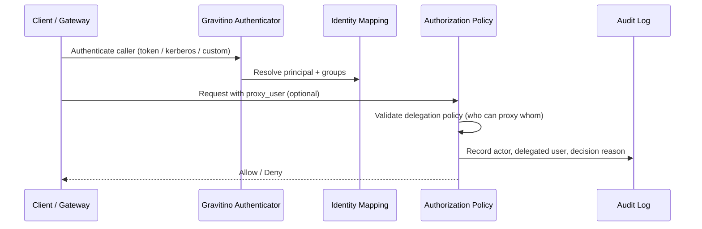

###

### **Introduction**

In a traditional single-system architecture, authentication is often treated as a login feature. In a Catalog of Catalogs architecture, authentication is a trust integration problem.

Gravitino is designed for heterogeneous enterprise environments: multi-cloud, hybrid-cloud, mixed identity providers, and multiple runtime channels. In that world, the hardest question is not "which protocol should we use?" The harder question is "how do we keep identity semantics consistent when authentication paths are diverse?"

This post focuses on one scope only: **User -> Gravitino authentication**.  
It does not expand into downstream catalog authentication in this article.

This distinction matters. Many architecture conversations collapse authentication into tooling debates. In practice, authentication quality is determined by system design choices: identity normalization, trust boundary contracts, failure semantics, and operational governance.

###

### **Scope of This Post**

This article covers:

- User authentication entry into Gravitino.
- Identity extraction and normalization.
- Multi-authenticator coexistence and trust convergence.
- Group and role design boundaries.
- Proxy user design considerations.
- Extensibility through authenticator plugins.

This article intentionally does not cover:

- Gravitino-to-underlying-catalog authentication patterns.
- Credential vending internals.
- Downstream impersonation semantics.

### **High-Level Architecture View**

```mermaid
flowchart LR
  U[End User / Workload] --> C[Access Channel<br/>UI / API / Engine]
  C --> A[Authenticator Layer<br/>simple | oauth | kerberos | custom]
  A --> N[Identity Normalization<br/>principalFields + mapping]
  N --> P[Policy Context<br/>user group roles proxy metadata]
  P --> Z[Authorization and Audit]
```

This diagram reflects the core design intent for northbound authentication: diverse entry modes are allowed, but they must converge into one normalized policy context before authorization and auditing.

###

### **Challenges in User -> Gravitino Authentication**

#### **1) Identity heterogeneity across enterprise environments**

In real deployments, one organization can have multiple identity systems and conventions at the same time. Claims differ by IdP, principal naming differs by product, and group semantics differ by platform.

If Gravitino treats identity as raw input rather than normalized trust context, policy behavior quickly becomes inconsistent.

A typical example is principal ambiguity: one IdP may prefer `preferred_username`, another only guarantees `sub`, and a third may expose email-style identity. Without deterministic extraction rules, the same human identity can appear as multiple principals in access control and audit trails.

#### **2) Mixed access channels require mixed authentication paths**

Different channels have different practical requirements:

- UI and interactive API users often align best with OAuth/OIDC flows.
- Some data platform paths are still heavily Kerberos-oriented.
- Development and local testing often need low-friction `simple` mode.

A single global authenticator strategy is rarely realistic for enterprises.

That is why mixed-mode support should be treated as a design requirement, not as temporary compatibility logic.

A practical way to reason about this is to separate **protocol diversity** from **policy diversity**:

- Protocol diversity is expected and healthy in enterprise environments.
- Policy diversity for equivalent identities is dangerous and should be minimized.

In other words, channels can differ, but policy semantics should converge.

###

#### **3) Group identity can drift over time**

Many authorization failures are not caused by failed login, but by stale or mismatched user-group relationships. If group truth is fragmented, role enforcement becomes noisy and unreliable.

In large organizations, this issue appears during org changes, contractor lifecycle events, and cross-team projects. If group semantics are not anchored in one authority, access updates become delayed and policy intent diverges from runtime behavior.

#### **4) Extensibility is mandatory, not optional**

Enterprises frequently require custom identity integration. LDAP is a common example. A closed authenticator model cannot serve long-lived heterogeneous ecosystems.

The key point is not just "support more protocols." It is "support controlled extension without fragmenting trust semantics."

#### **5) Proxy user creates power and risk at the same time**

Proxy user patterns are often needed in shared compute and gateway mediation scenarios. But without strict controls, proxy semantics can become an implicit privilege escalation path.

The design tension is clear: proxy user enables practical operations, but expands the security surface. A mature design must preserve delegation utility while preventing identity confusion.

###

### **Our Design Choices**

#### **1) Multi-authenticator, with explicit coexistence**

Gravitino supports multiple authentication mechanisms:

- `simple`
- `oauth`
- `kerberos`
- custom authenticators

`simple` authentication is intentionally lightweight and follows the spirit of Hadoop simple mode.  
In this model, the client provides a username context directly (for example from environment/user context), and the server treats that identity as the request principal without strong cryptographic proof from an external IdP.

This makes `simple` mode useful for:

- local development,
- functional testing,
- quick PoC environments where identity infrastructure is not yet wired.

But it should be treated as a development-oriented trust mode, not a production-grade identity control:

- no external identity proof chain,
- higher spoofing risk if network and runtime boundaries are weak,
- limited suitability for strict audit and compliance expectations.

So the design recommendation is straightforward: use `simple` where developer speed matters, and move to stronger modes (`oauth`, `kerberos`, or controlled custom auth) for production governance.

Multiple authenticators can be configured at the same time to match different access channels in one organization. This is a practical design choice for mixed environments, not only a migration convenience.

For example, a single enterprise deployment can route UI and interactive API traffic through OAuth/OIDC, while keeping Kerberos for specific data platform access paths that already rely on established Kerberos trust.

#### **2) OAuth as a first-class path**

OAuth is a strategic focus because it fits modern enterprise identity and cloud-native operations. In Gravitino, OAuth support includes:

- Static signing key validation for controlled environments.
- JWKS-based validation for dynamic key management and OIDC ecosystems.
- OIDC-oriented Web UI integration.
- API bearer-token usage patterns.

The point is not "OAuth is trendy."  
The point is that OAuth provides a strong operational center for federated enterprise identity.

From an architecture perspective, OAuth gives us three important properties:

- standard token semantics across many providers,
- clear validation boundaries,
- practical alignment between user-facing login and API authentication models.

It is also where many teams underestimate design complexity. OAuth success is not only about token verification. It is about ensuring that verified identity is transformed into a stable authorization subject with predictable semantics over time.

#### **3) Identity extraction and normalization**

Identity claims are not uniform across IdPs. Gravitino supports claim fallback extraction (for example with `principalFields`) so principal resolution is stable even when token claim priorities differ by provider.

This is not a convenience detail. It is a trust consistency mechanism.

When principal extraction is explicit, authorization policy becomes more predictable and incident analysis becomes more reliable.

#### **4) User/group mapping as a formal abstraction**

Different identity domains use different user and group naming schemes. Gravitino uses mapping abstractions so identity can be normalized before policy evaluation.

This avoids connector-by-connector ad hoc translation logic and enables consistent authorization semantics across environments.

It also helps teams evolve safely. If naming conventions or identity providers change, translation logic can be adapted at the abstraction layer instead of being scattered across integrations.

#### **5) IdP as Single Source of Truth for user/group**

A key design decision: Gravitino should be identity-integrated, not identity-authoritative.

- IdP remains the source of truth for users and groups.
- Gravitino focuses on authentication integration, normalization, and governance.
- Gravitino acts as an identity-aware authorization platform, not a full-featured IAM directory.

This design minimizes identity drift and avoids duplicate IAM systems.

It also clarifies ownership boundaries: IdP owns identity truth, while Gravitino owns identity interpretation for policy execution.

This boundary is especially important in enterprise environments where IAM systems are already mature (`LDAP`, `AD`, `Okta`, `Azure AD`, `Keycloak`, and others). Rebuilding user master-data management inside Gravitino would introduce duplicate control planes, synchronization complexity, and avoidable inconsistency risk.

By not positioning Gravitino as a primary IAM directory, the platform can stay focused on what matters most for a Catalog of Catalogs architecture:

- unified authorization semantics across heterogeneous catalogs,
- consistent identity-to-policy translation,
- and governance-grade auditability.

At the same time, "not identity-authoritative" does not mean "no user-related control-plane capability." Gravitino can still provide limited operational capabilities where they are practical and safe:

- bootstrap user handling for local development and PoC environments,
- user/group cache and mapping strategies for runtime consistency,
- break-glass admin mechanisms for emergency operations,
- audit-oriented identity snapshots for traceability (without becoming authoritative identity records).

#### **6) Role and group are complementary, not redundant**

One recurring design question is: if role exists, do we still need group?

Yes.

- Roles answer: **what can be done**.
- Groups answer: **who moves together** in organizational lifecycle.

Removing groups may look simpler initially, but usually introduces long-term governance debt in enterprise operations.

A practical pattern is to keep role definitions stable and let group membership absorb organizational change. This keeps policy models durable while reducing per-user permission churn.

#### **7) Plugin-based extensibility**

Gravitino provides an extensible authenticator plugin mechanism so enterprises can integrate environment-specific identity requirements without breaking platform trust architecture.

LDAP is a common requirement in this space, and future native support can naturally fit this extensible model.

The plugin model is valuable only if it remains governable. Extension points should preserve common audit fields, consistent principal semantics, and clear security expectations.

#### **8) Proxy user as controlled delegation**

Proxy user is useful in scenarios such as:

- Shared compute clusters.
- Gateway-mediated requests.
- Automation that must preserve end-user accountability.

But proxy user must be treated as a controlled delegation model, not an authentication shortcut. Safe design requires:

- explicit impersonation policy,
- constrained delegation scope,
- complete audit chain of actor and delegated principal.

In other words, proxy user should answer three audit questions for every delegated request: who initiated the call, who was delegated, and why delegation was allowed.



The security invariant is simple: proxy delegation must be explicit and policy-checked, never inferred from transport behavior alone.

###

### **OAuth Design Focus**

Because OAuth is a primary focus in Gravitino, a few design principles are especially important:

1. **Validation path is a security decision**  
   Static key and JWKS are not equivalent operationally. Pick based on key lifecycle and incident response requirements.

2. **Claim contract must be intentional**  
   Fields like `aud`, `iss`, and principal extraction order should be designed as policy contracts, not accidental defaults.

3. **UI and API flows must converge in trust semantics**  
   Different interaction styles can share one trust model if principal normalization is consistent.

4. **Observability matters as much as validation**  
   Knowing *why* authentication decisions succeed or fail is critical for governance and incident handling.

5. **Fallback and migration must be explicit**  
   In enterprise rollouts, OAuth is often introduced gradually. During coexistence with other authenticators, systems should define deterministic routing and principal convergence rules, not rely on implicit ordering assumptions.

6. **OAuth should be designed with group truth strategy**  
   If group information comes from IdP claims, extraction and refresh expectations must be documented. If group lookup is externalized, cache and consistency behavior must be defined as part of auth design.

7. **Token validation should have clear failure semantics**  
   Teams should define endpoint-level behavior for IdP timeout, JWKS refresh failure, and malformed claims. Not all APIs need the same strictness, but all APIs need an explicit decision.

8. **Migration posture should be staged, measurable, and reversible**  
   Moving from legacy auth to OAuth should use phased rollout with observability checkpoints and rollback criteria. Authentication migration without runtime measurement is risk transfer, not risk reduction.

###

### **Design Decision Matrix**

The following matrix helps teams make concrete architecture decisions instead of abstract preferences:

| Design question | Preferred default | Why |
|---|---|---|
| User/group source of truth | External IdP | Avoid duplicate identity control planes |
| Multi-channel authentication | Allow coexistence | Fit real enterprise workflows |
| Principal extraction | Ordered fallback (`principalFields`) | Reduce principal ambiguity |
| Group consistency | IdP-led with explicit refresh strategy | Avoid policy drift |
| Custom enterprise identity | Plugin extension | Keep platform extensible without forking |
| Proxy delegation | Explicit policy + full audit trail | Preserve accountability |

Even when teams make different implementation choices, this matrix keeps decision rationale explicit and reviewable.

###

### **Operational Rollout Notes**

Good authentication architecture can still fail during rollout if operational assumptions are implicit. A lightweight rollout checklist can prevent most surprises:

- start with one authoritative principal contract and document it,
- observe principal and group resolution before enforcing stricter policies,
- roll out proxy user with narrow allowlists first,
- treat audit completeness as a release criterion, not a post-release task,
- define and test failure behavior for validation dependencies.

These are operational details, but they are direct consequences of design quality.

###

### **Challenge-Solution Snapshot**

To summarize the design thinking in one view:

- **Challenge:** identity heterogeneity  
  **Solution:** principal extraction + mapping abstraction.
- **Challenge:** mixed channels and mixed auth modes  
  **Solution:** multi-authenticator coexistence with trust convergence.
- **Challenge:** group drift  
  **Solution:** IdP as single source of truth for user/group.
- **Challenge:** enterprise-specific requirements  
  **Solution:** plugin-based extensibility with governance constraints.
- **Challenge:** delegated execution accountability  
  **Solution:** proxy user as explicit, auditable, constrained delegation.

###

### **Architecture Principles**

- **Mode diversity is a feature; trust inconsistency is the risk.**
- **Identity quality determines authorization quality.**
- **IdP is the source of truth; Gravitino is the trust integration layer.**
- **Delegation must be explicit, constrained, and auditable.**

###

### **Conclusion**

For Gravitino, user authentication is not a narrow login concern. It is the northbound trust foundation for the entire control plane.

The design goal is not to force one authentication mode.  
The design goal is to allow diverse authentication modes while converging to consistent identity semantics and reliable policy outcomes.

If we frame authentication only as protocol selection, we get configuration checklists.  
If we frame authentication as federated trust design, we get systems that remain secure and operable as organizations, identity providers, and access patterns evolve.

That is what "authentication as federated trust" means in practice.
